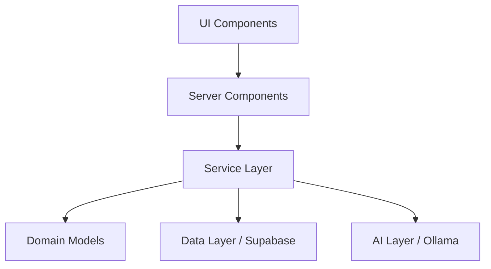

<p align="center">
  
</p>

# <p align="center">🚀 BuildThis.dev</p>

<p align="center">
  <strong>Turn frustrations into foundations. The community-powered problem discovery platform.</strong>
</p>

<p align="center">
  <a href="https://nextjs.org">
    
  </a>
  <a href="https://supabase.com">
    
  </a>
  <a href="https://ollama.com">
    
  </a>
  
</p>

<p align="center">
  <a href="./src/app/browse/page.tsx">Browse Problems</a> • 
  <a href="./src/app/submit/page.tsx">Submit Idea</a> • 
  <a href="./documents/02%20-%20Product%20Requirements.md">Read the PRD</a>
</p>

---

### 💡 What is BuildThis.dev?

BuildThis.dev is a "Problem-as-a-Service" platform. Most developers struggle to find a good project idea. BuildThis.dev bridges the gap between people with real-world problems and developers with the skills to solve them.

### ✨ Key Features

| Feature | Description |
| :--- | :--- |
| **🧠 AI Articulation** | Turns rough, messy user complaints into professional, actionable problem statements using local AI. |
| **▦ Browse & Filter** | Discover problems by industry, difficulty, or impact. |
| **🛡️ Clean Architecture** | Built with scalability in mind using decoupled services and strongly-typed models. |
| **🚀 Supabase Powered** | Real-time updates, secure authentication, and a robust PostgreSQL backbone. |

### 🛠️ Technical Architecture

The project follows the **Clean Architecture** pattern, providing a strict separation of concerns that makes it easy to test and scale.



#### 📁 Directory Structure
```text
src/
├── app/          # App Router (Endpoints & Pages)
├── components/   # Atomic UI primitives & complex organisms
├── lib/          # Hard-wired integrations (Supabase, Auth)
├── services/     # Pure business logic & AI orchestration
└── types/        # Global TypeScript interfaces
```

---

### 🚀 Getting Started

Launch your local development environment in 60 seconds.

#### 1. Requirements
- Node.js 18+ & npm
- [Ollama](https://ollama.com) (Running `qwen2:1.5b`)

#### 2. Installation
```bash
git clone https://github.com/AmanSoni1-apex/BuildThis.git
cd BuildThis
npm install
```

#### 3. Environment Setup
Copy the template and add your Supabase keys.
```bash
cp .env.example .env.local
```

#### 4. Run the Engine
```bash
ollama run qwen2:1.5b
npm run dev
```

---

<div align="center">
  <sub>Built with ❤️ by Aman </sub>
</div>
