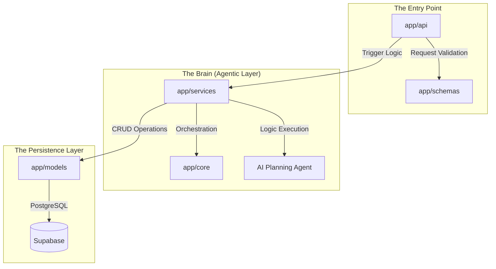

# 🚀 BuildThis: The Agentic Infrastructure Architect
### *Generating Production-Grade Technical Blueprints from Human Intent*

[](https://github.com/AmanSoni1-apex/BuildThis)
[](https://github.com/AmanSoni1-apex/BuildThis)
[](https://github.com/AmanSoni1-apex/BuildThis)

**BuildThis** is a developer-centric orchestration engine that automates the transition from "Idea" to "Architecture." It uses a multi-agent system to decompose complex product requirements into modular, scalable technical designs.

---

## 🧬 System Architecture
BuildThis follows a **Decoupled Layered Architecture**, ensuring absolute separation between the AI Orchestration, Business Logic, and Data Persistence layers.


```mermaid
graph TD
    subgraph "The Entry Point"
        api[app/api] -->|Request Validation| schemas[app/schemas]
    end

    subgraph "The Brain (Agentic Layer)"
        services[app/services] -->|Orchestration| core[app/core]
        services -->|Logic Execution| agent[AI Planning Agent]
    end

    subgraph "The Persistence Layer"
        services -->|CRUD Operations| repo[app/models]
        repo -->|PostgreSQL| db[(Supabase)]
    end

    api -->|Trigger Logic| services

```

## 📂 Engineering Design
This repository is built for Scale and Maintainability. We follow the "Clean Architecture" principles:

- app/api/: The Interface Layer. Handles REST endpoints and HTTP logic.
- app/services/: The Core Service Layer. This is where the Agentic Orchestration lives. It handles the lifecycle of AI requests and tool calls.
- app/models/: The Data Layer. Definitions for database entities using SQLAlchemy/Tortoise.
- app/schemas/: The Validation Layer. Pydantic models that ensure Strict JSON Compliance and zero-hallucination outputs.
- app/core/: The Foundation Layer. Global configs, security, and LLM provider management.

## ✨ Key Capabilities
- Multi-Agent Orchestration: Decomposes a single prompt into database schemas, API maps, and infrastructure requirements.
- Schema Enforcement: Leverages Pydantic to force LLMs into producing machine-readable JSON, eliminating the need for post-processing regex.
- Modular Provider Switching: Abstracted service layer allows zero-code switching between Claude 3.5 Sonnet, Gemini 2.0.

## 🛠 Tech Stack
- Backend: Python 3.11, FastAPI
- Frontend: Next.js 15, Tailwind CSS
- Orchestration: LangChain, Pydantic
- Database: Supabase (PostgreSQL)
- Deployment: Vercel / Render

## 🚀 Quick Start
```
Clone & Setup:
bash

- git clone https://github.com/AmanSoni1-apex/BuildThis.git
- cd BuildThis
- pip install -r requirements.txt

## Environment Configuration: Create a .env file with your OPENROUTER_API_KEY and DATABASE_URL.
- Launch the Engine:
- bash
- uvicorn app.main:app --reload
```
🔮 Future Roadmap
 - LangGraph Integration: Moving towards stateful graph-based agents for complex multi-turn architecture planning.
 - Automated Repo Scaffolding: Directly generating a boilerplate GitHub repo from the generated JSON blueprint.
 - Cloud Infra Mapping: Integrating Terraform/AWS CDK generation.

## 🤝 Founder
**Aman Soni**  
*Founding Engineer*  
[LinkedIn](https://www.linkedin.com/in/aman-soni-42874b2ba) 
